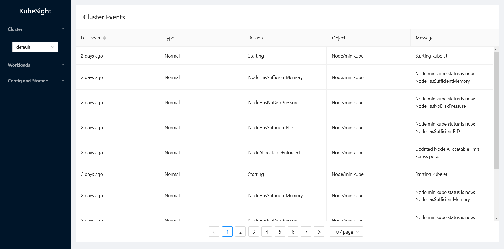
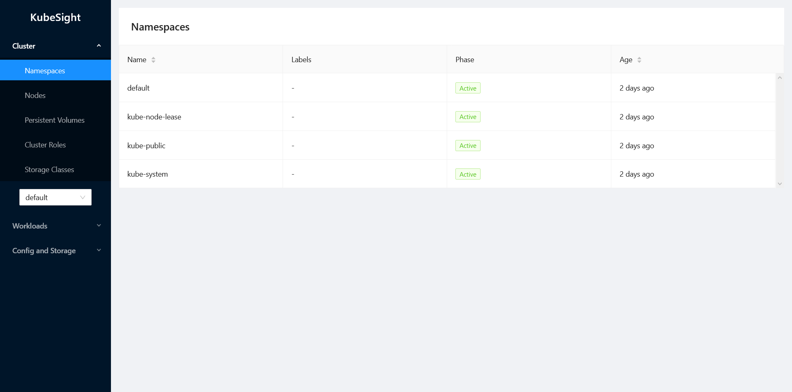
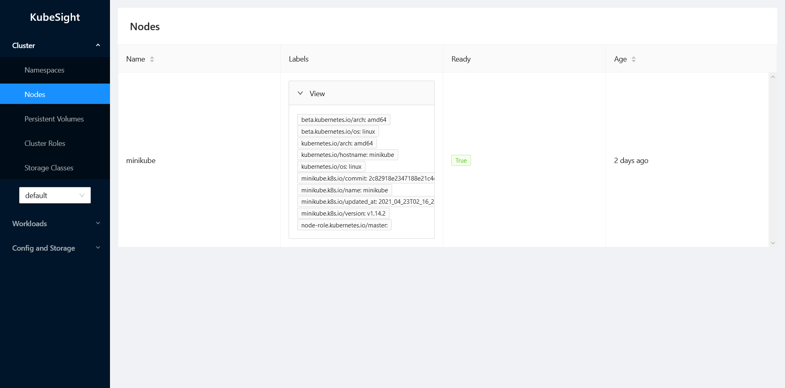
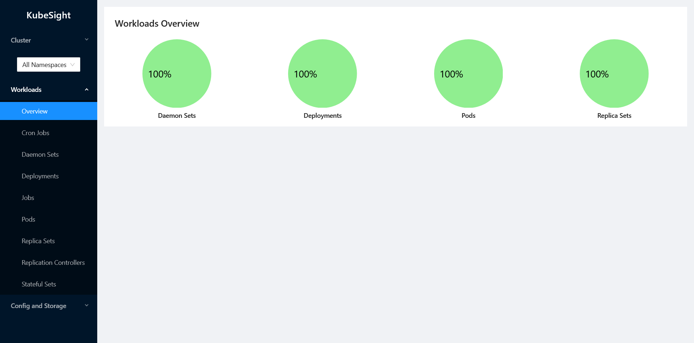
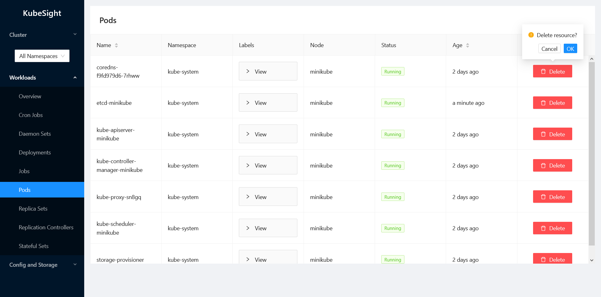

# KubeSight

A user interface for you K8s cluster.

## Usage

To run,

### Client

```sh
cd client

# Install dependencies
npm i

# Start React server
npm start
```

### server

```sh

cd server

# Install dependencies
npm i

# Start Express server
npm start
```

## Screenshots

Some sample screenshots.

1. Homepage


2. Namespaces


3. Nodes


4. Workloads Overview


5. Actions
